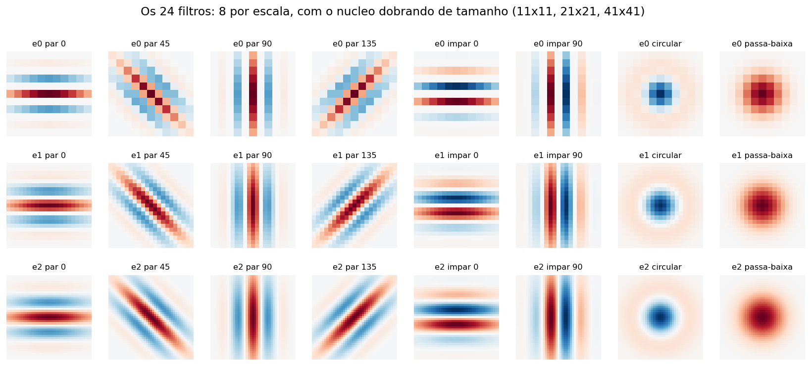

%%titulo: Segmentação de texturas urbanas com um banco de 24 filtros em três escalas
%%autores: Vitor Lorenzo Cumim
%%curso: Visão Computacional — Trabalho 1
%%data: setembro de 2026
%%repo: https://github.com/vitorcumim/textura-urbana

## Resumo

Vinte e quatro filtros de textura — oito por escala, em três tamanhos de núcleo — são aplicados a 32 recortes de 512×512 pixels em tons de cinza, de oito materiais urbanos. A média de cada filtro dentro de uma janela é uma dimensão do vetor, então 24 filtros dão exatamente 24 dimensões, sem nenhuma reorganização no meio. Um k-médias euclidiano agrupa os vetores próximos, com pureza de 0,53 em relação ao material fotografado, e o mesmo vetor calculado janela a janela segmenta o interior das imagens.

## 1. Os 24 filtros

O enunciado oferece dois caminhos para o multiescala: construir os filtros em três tamanhos, ou construir um banco só e encolher a imagem. Aqui foi tomado o primeiro, que é o que faz o número de filtros ser literalmente 24.

São oito filtros por escala:

- **quatro Gabor de fase par** (cosseno) a 0°, 45°, 90° e 135°. A fase par tem lobo central: detecta **linha**. São eles que cobrem as quatro orientações pedidas no enunciado;
- **dois Gabor de fase ímpar** (seno) a 0° e 90°. Antissimétricos, detectam **borda** em vez de linha — um ripado de madeira e uma parede de tijolos podem ter a mesma orientação dominante e ainda assim serem coisas diferentes;
- **um LoG circular**, isotrópico, que responde a granulação sem direção preferida e é quem caracteriza asfalto e brita;
- **uma gaussiana passa-baixa**, que dá o nível de cinza médio da vizinhança. Não é textura no sentido estrito, mas no conjunto urbano a luminância separa bem asfalto escuro de concreto claro.

As três escalas dobram: núcleos de 11×11, 21×21 e 41×41, com o comprimento de onda e o σ dobrando junto. A imagem fica sempre em 512×512.

## 2. O vetor de 24 dimensões

Cada filtro é convoluído com a imagem e do resultado toma-se o valor absoluto — uma barra clara sobre fundo escuro e uma barra escura sobre fundo claro são a mesma textura, e sem retificar a média da janela daria quase zero para as duas.

O descritor de uma região é a média de cada um dos 24 mapas dentro da janela. Vinte e quatro filtros, vinte e quatro números, um por filtro.

A única conta entre a média e o vetor final é um logaritmo. Ele existe porque as médias têm cauda longa: uma única junta de argamassa muito contrastada produz uma média várias vezes maior que a do resto da imagem e passa a dominar a distância euclidiana. Medido neste conjunto, a pureza sobe de **0,47 para 0,53** só por causa dessa linha.

Antes do agrupamento cada dimensão passa por z-score, o que aqui é obrigatório: a passa-baixa vale cerca de 120 e um Gabor vale cerca de 3, então sem normalizar a distância euclidiana mediria apenas diferença de brilho.

## 3. As 32 imagens

Quatro imagens de cada um dos oito materiais — asfalto, brita, calçada, concreto, madeira, paralelepípedo, telha e tijolo — dão as 32 do enunciado. São recortes de 512×512 em tons de cinza, vindos de fotos do Wikimedia Commons sob licenças livres; cabe a ressalva de que o enunciado pede fotos do próprio grupo, e estas não são.

## 4. Agrupamento

O k-médias é euclidiano, escrito à mão, com centroides sorteados entre as próprias amostras, semente fixa e oito reinicializações, ficando com a de menor inércia. Com k = 8, o número de materiais, a pureza é **0,53** — a fração de imagens que caiu no material majoritário do seu grupo.

A pureza de 0,53 é modesta, e a figura explica por quê: o método agrupa por **aparência de textura**, não por material. Britas e paralelepípedos rugosos são granulação grossa isotrópica e o filtro circular os vê como a mesma coisa. As telhas se espalham por três grupos, porque telha de frente, em diagonal e empilhada são texturas diferentes que por acaso têm o mesmo nome. São erros de etiqueta, não de método.

## 5. Segmentação

O mesmo k-médias sobre as 7.200 janelas de 64×64 de todas as imagens, com k = 6, dá a cada janela o rótulo do grupo mais próximo.

Vale notar uma diferença em relação às outras versões deste trabalho, que usam pirâmide em vez de filtros grandes. Filtrar a imagem cheia com núcleos de 41×41 suaviza bastante: em `madeira_00` as frestas estreitas entre as ripas, que a versão com pirâmide separava, aqui somem dentro do borrão do filtro maior. Em compensação os mapas ficam menos pipocados. É um dos dois lados do mesmo compromisso.

## Referências

1. Gabor, D. *Theory of communication*. Journal of the IEE, 1946.
2. Jain, A. K.; Farrokhnia, F. *Unsupervised texture segmentation using Gabor filters*. Pattern Recognition, v. 24, n. 12, 1991.
3. Randen, T.; Husøy, J. H. *Filtering for texture classification: a comparative study*. IEEE TPAMI, v. 21, n. 4, 1999.
