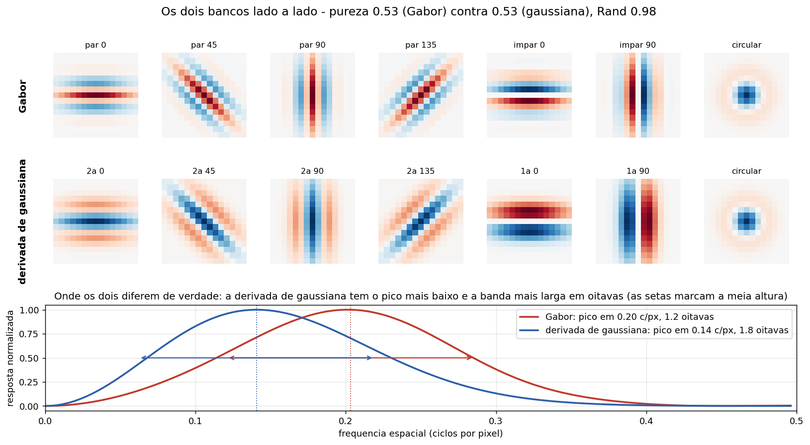
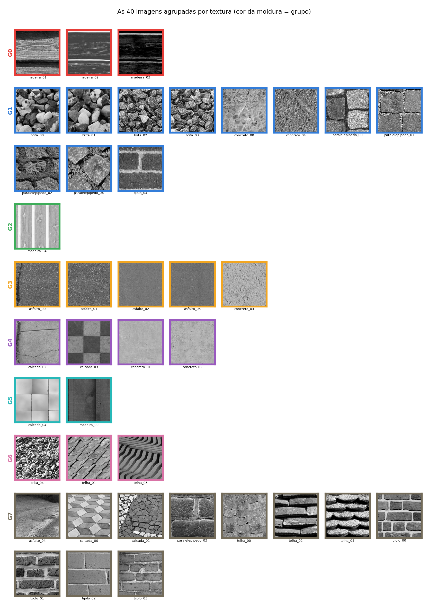
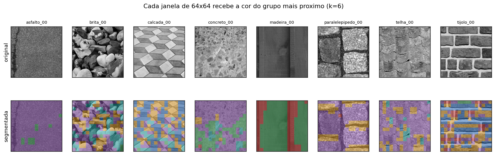

%%titulo: Trocando Gabor por derivadas de gaussiana no mesmo banco de textura
%%autores: Vitor Lorenzo Cumim
%%curso: Visão Computacional — Trabalho 1 (variação do banco de filtros)
%%data: setembro de 2026
%%repo: https://github.com/vitorcumim/textura-urbana

## Resumo

O banco de filtros de Gabor usado nas outras versões deste trabalho é trocado por um banco de **derivadas de gaussiana**, mantendo tudo o mais idêntico: as mesmas 40 imagens, a mesma pirâmide de três escalas, o mesmo vetor de 24 dimensões e o mesmo k-médias. O objetivo é isolar o efeito do banco. O resultado é que quase não há efeito: as duas versões dão a mesma pureza (0,53) e agrupamentos praticamente iguais — índice de Rand 0,98, com **uma única imagem** das 40 mudando de grupo.

## 1. A troca

Um filtro de Gabor é uma onda — cosseno ou seno — presa dentro de uma envoltória gaussiana. A frequência dessa onda é um parâmetro livre (λ), então o Gabor é um filtro **sintonizado**: ele tem uma frequência espacial preferida e responde mal fora dela.

Uma derivada de gaussiana não tem onda nenhuma. É só a gaussiana derivada uma ou duas vezes numa direção. Não existe parâmetro de frequência: quem determina o que o filtro enxerga é o σ da gaussiana, e no nosso caso isso vem da escala da pirâmide.

O paralelo entre os dois bancos é exato, filtro a filtro, e é isso que torna a comparação limpa:

| Papel | Banco de Gabor | Banco de gaussianas |
|---|---|---|
| detector de linha (simétrico) | Gabor de fase par, cosseno | 2ª derivada da gaussiana |
| detector de borda (antissimétrico) | Gabor de fase ímpar, seno | 1ª derivada da gaussiana |
| granulação sem direção | LoG circular | o mesmo LoG circular |

Nos dois casos são quatro detectores de linha (0°, 45°, 90° e 135°), dois de borda (0° e 90°) e um circular: sete filtros por escala, três escalas, 21 mapas de resposta.

A envoltória das derivadas é uma gaussiana **alongada** — estreita na direção em que a derivada é tomada (σ = 1,6 px) e três vezes mais comprida na direção perpendicular. É o alongamento que dá seletividade a orientação; uma gaussiana redonda derivada seria quase um detector de borda genérico, sem preferência de direção.



O gráfico de baixo mostra a diferença real entre os dois, e ela é menor do que se costuma dizer. Em largura absoluta as duas bandas são quase iguais (0,16 contra 0,16 ciclos por pixel a meia altura). O que muda é a posição: o Gabor tem o pico em 0,20 ciclos/px e a derivada em 0,14, o que faz a derivada ser proporcionalmente mais larga — **1,8 oitavas contra 1,2**. Em outras palavras, o Gabor é mais seletivo, mas por uma margem modesta nesta configuração.

## 2. O que mudou no resultado

Praticamente nada.

| | Gabor | Derivada de gaussiana |
|---|---|---|
| pureza (k = 8) | 0,53 | 0,53 |
| índice de Rand entre os dois agrupamentos | — | 0,98 |
| imagens que trocaram de grupo | — | 1 de 40 (`calcada_02`) |

O índice de Rand mede a fração dos pares de imagens em que os dois agrupamentos concordam — ou os dois puseram o par junto, ou os dois separaram — e não depende de como os grupos foram numerados. Com 0,98, os dois particionamentos são quase o mesmo objeto.

A única imagem que se moveu foi `calcada_02`, um trecho de placa de concreto com uma junta atravessando e uma faixa de terra na borda. Com Gabor ela foi parar entre os blocos com juntas; com as derivadas, entre as superfícies quase lisas. É uma imagem de fronteira: tem pouca textura e uma única linha forte, então qualquer perturbação pequena no descritor a joga de um lado para o outro. Não é um caso em que um banco acerta e o outro erra.





## 3. Por que dá quase no mesmo

Três razões, e vale entendê-las porque elas dizem mais sobre o problema do que sobre os filtros.

A primeira é que o descritor **joga fora** boa parte da diferença. O que entra no vetor não é a resposta do filtro, é a *média do módulo da resposta* numa janela de 64×64 pixels — e depois ainda é normalizada pela energia total da escala. Duas medidas de "quanta energia horizontal existe nesta janela" tendem a concordar mesmo quando os filtros que as produziram são bem diferentes.

A segunda é que a pirâmide de três escalas cobre a mesma faixa de tamanhos nos dois casos. Se um banco tivesse acesso a frequências que o outro não vê, a diferença apareceria; mas os dois varrem a mesma faixa, com bandas de largura parecida.

A terceira é que as texturas urbanas deste conjunto não são periódicas o bastante para premiar a seletividade do Gabor. A vantagem de um filtro sintonizado aparece quando existe uma frequência bem definida a ser encontrada — um tecido, uma tela, uma grade regular. Tijolo e telha chegam perto disso, mas asfalto, brita e concreto não têm frequência nenhuma, e são metade do conjunto.

## 4. Como rodar

```
python gaussianos/textura_gaussianos.py    # roda o pipeline com as gaussianas
python gaussianos/comparar.py              # roda os dois bancos e compara
```

O primeiro escreve `saida/banco.png`, `saida/grupos.png` e `saida/segmentacao.png`; o segundo escreve `saida/comparacao.png` e imprime a tabela de números desta página.

O arquivo `textura_gaussianos.py` só define o banco de filtros e importa o resto do pipeline de `simples/textura_simples.py`. Isso é deliberado: garante que a comparação não esteja medindo, sem querer, alguma outra diferença de implementação.

## Referências

1. Freeman, W. T.; Adelson, E. H. *The design and use of steerable filters*. IEEE TPAMI, v. 13, n. 9, 1991.
2. Randen, T.; Husøy, J. H. *Filtering for texture classification: a comparative study*. IEEE TPAMI, v. 21, n. 4, 1999.
3. Varma, M.; Zisserman, A. *A statistical approach to texture classification from single images*. IJCV, v. 62, 2005.
