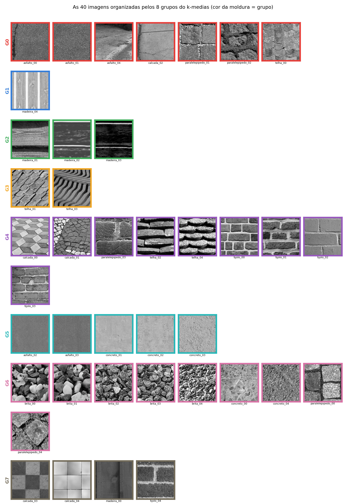
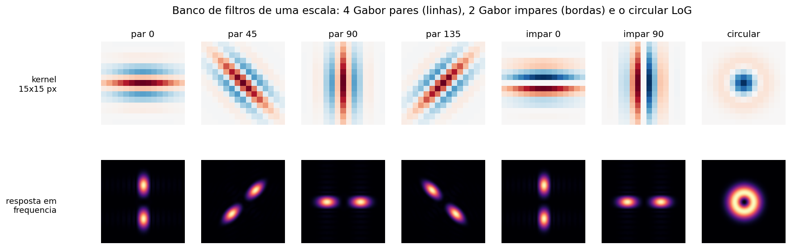
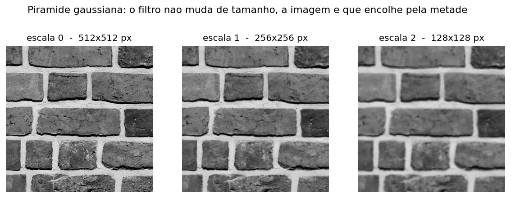
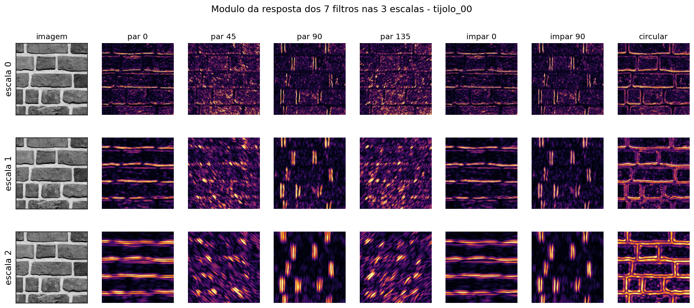
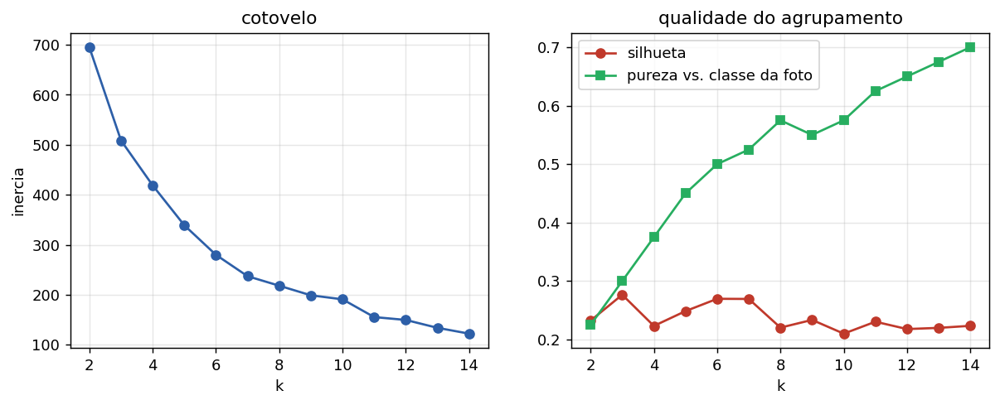
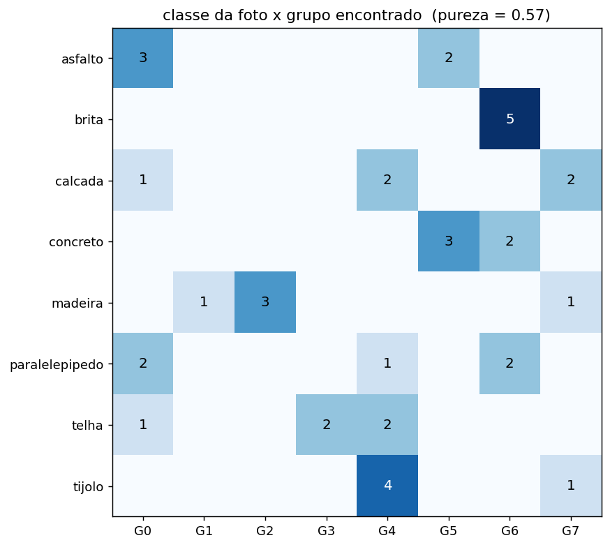
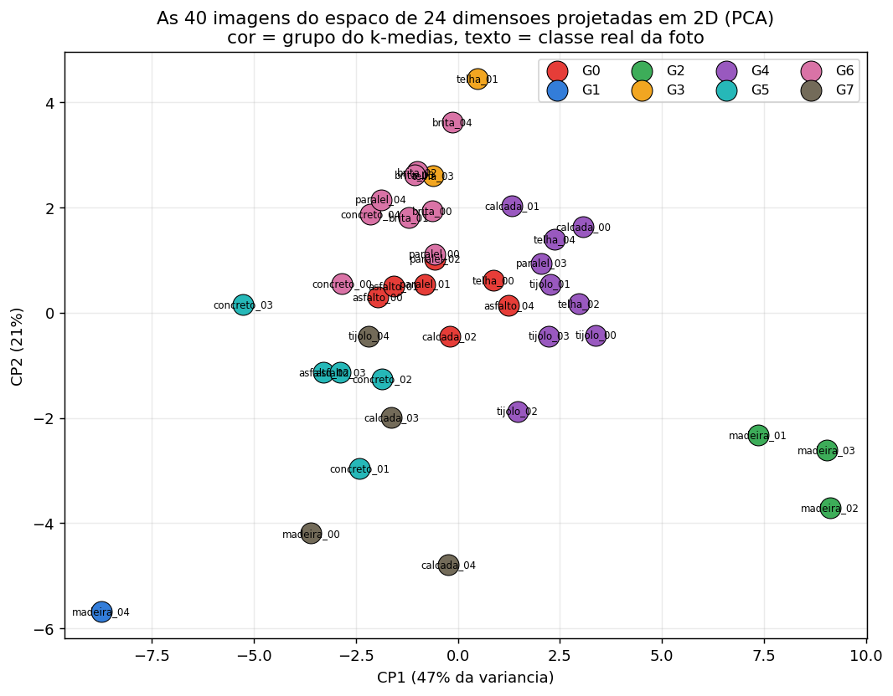
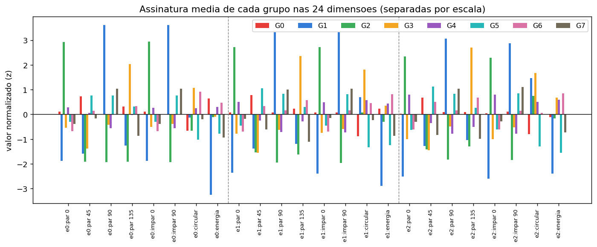
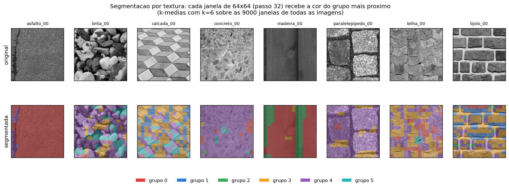

%%titulo: Segmentação de texturas urbanas com um banco de filtros orientados em três escalas
%%autores: Vitor Lorenzo Cumim
%%curso: Visão Computacional — Trabalho 1
%%data: setembro de 2026
%%repo: https://github.com/vitorcumim/textura-urbana

## Resumo

Este trabalho monta um descritor de textura de 24 dimensões a partir de um banco de sete filtros — quatro Gabor de fase par nas orientações 0°, 45°, 90° e 135°, dois Gabor de fase ímpar em 0° e 90° e um filtro circular (Laplaciano da gaussiana) — aplicados em três escalas de uma pirâmide gaussiana. O descritor de cada região é a média das respostas dentro de uma janela, reorganizada em *perfil* (como a energia se reparte entre os filtros) e *energia total* por escala. Um k-médias euclidiano escrito à mão agrupa 40 recortes de 512×512 pixels em tons de cinza, de oito materiais urbanos. Com k = 8 os grupos encontrados têm pureza de 0,58 em relação ao material fotografado, e a inspeção visual mostra que os erros não são aleatórios: o método agrupa por *aparência de textura*, e materiais diferentes com a mesma aparência caem juntos. O mesmo descritor, calculado em janelas de 64×64 pixels, segmenta o interior das imagens e separa, por exemplo, as juntas de argamassa das faces dos tijolos.

## 1. Introdução

Duas regiões de uma imagem em tons de cinza podem ter exatamente o mesmo histograma e ainda assim serem visivelmente diferentes: uma parede de tijolos e um trecho de asfalto podem ter o mesmo brilho médio, mas a parede tem linhas horizontais fortes e o asfalto não tem direção nenhuma. É essa diferença — como a intensidade *varia* no espaço, e em que direção e em que tamanho — que chamamos de textura.

A estratégia clássica para medi-la é passar a imagem por um conjunto de filtros sintonizados em diferentes orientações e frequências e olhar quanta energia cada um capta. Este trabalho segue exatamente essa receita, com filtros de Gabor e um filtro circular, e usa os vetores resultantes para duas tarefas: agrupar um conjunto de 40 imagens por semelhança de textura e segmentar o interior de cada imagem.

Nada aqui usa aprendizado de máquina moderno: os filtros são fixos e projetados analiticamente, e o agrupamento é um k-médias euclidiano de trinta linhas.

## 2. Conjunto de imagens

### 2.1 Origem

O conjunto é de **texturas urbanas**: asfalto, brita, calçada, concreto, madeira (tapumes e ripados), paralelepípedo, telha e tijolo — oito classes, cinco imagens cada, **40 imagens** no total.

As fotos vieram do Wikimedia Commons, sob licenças livres (CC0, CC BY, CC BY-SA e domínio público). O arquivo `fotos_originais/creditos.csv` registra, para cada foto usada, o título, o autor, a licença e o endereço da página de origem; esse arquivo é gerado por `src/creditos.py`, que confere o SHA-256 do arquivo local contra a imagem publicada no Commons, de modo que o crédito nunca é atribuído à foto errada.

Vale registrar uma ressalva honesta: o enunciado pede fotos tiradas pelo próprio grupo, e estas não são. O código foi escrito de modo que essa troca custe um comando — basta colocar as fotos próprias em `fotos_originais/<classe>/`, apagar o arquivo `selecao.txt` e rodar o pipeline de novo; nada mais muda.

A busca textual do Commons é ruim para este fim. Pedir "chain link fence" devolve retratos de pessoas com uma cerca desfocada ao fundo, e "asphalt texture" devolve cartas de ruído usadas para calibrar scanners. Por isso foram baixadas 89 fotos candidatas e todas passaram por curadoria visual em folhas de contato; sobraram 36 fotos, listadas em `selecao.txt`. Uma nona classe pretendida, grades metálicas, foi abandonada porque nenhuma das 16 candidatas era utilizável.

### 2.2 Preparo

Cada foto aprovada é convertida de RGB para tons de cinza pela fórmula da ITU-R BT.601, que é a implementada por `cv2.cvtColor(..., COLOR_BGR2GRAY)`:

`Y = 0,299 R + 0,587 G + 0,114 B`

Em seguida a foto é recortada em blocos de **512×512** tomados de uma grade centrada, sem sobreposição, de modo que dois recortes da mesma foto nunca compartilham pixels. Das fotos com textura mais escassa (asfalto e brita) foram tirados dois recortes; das demais, um. O resultado são as 40 imagens de `imagens/`.



## 3. O banco de filtros

### 3.1 Os sete filtros

Um filtro de Gabor é uma onda cosseno (ou seno) multiplicada por uma envoltória gaussiana. Ele responde forte onde a imagem tem uma variação periódica com a orientação e o comprimento de onda para os quais foi sintonizado, e responde fraco em qualquer outro lugar. Os parâmetros usados são λ = 5 px de comprimento de onda, σ = 2,2 px de envoltória, razão de aspecto γ = 0,5 e núcleo de 15×15 px.

O banco tem sete filtros:

- **quatro Gabor de fase par** (cosseno), nas orientações 0°, 45°, 90° e 135°. A fase par tem um lobo central: é um detector de **linha**. São eles que cobrem as quatro orientações pedidas no enunciado — horizontal, 45°, vertical e 135°;
- **dois Gabor de fase ímpar** (seno), em 0° e 90°. A fase ímpar é antissimétrica: é um detector de **borda**, de degrau de intensidade. A distinção importa porque uma parede de tijolos e um ripado de madeira podem ter a mesma orientação dominante e mesmo assim serem coisas diferentes — um tem degraus, o outro tem linhas;
- **um filtro circular**, o Laplaciano da gaussiana (σ = 2,0). Ele é isotrópico: sua resposta em frequência é um anel, não um par de lobos. Responde a granulação e manchas sem direção preferida, e é ele que caracteriza asfalto e brita, que não têm orientação dominante nenhuma.

Todos os sete têm média zero, isto é, DC nulo. Isso garante que nenhum deles responda a brilho constante: uma parede clara e a mesma parede na sombra dão a mesma resposta, a menos do contraste.

A convenção de orientação adotada é a da *estrutura detectada*: um filtro a 0° responde a listras horizontais. Internamente a onda precisa variar na direção perpendicular às listras, então o código usa θ = α + 90° na fórmula da gaussiana modulada.



### 3.2 As três escalas

O enunciado oferece dois caminhos para o multiescala: construir os filtros em três tamanhos, ou construir os filtros uma vez só e encolher a imagem. Adotamos o segundo, que é mais barato — convoluir com um núcleo 15×15 três vezes numa imagem que encolhe custa muito menos que convoluir com núcleos 15×15, 29×29 e 57×57 na imagem cheia.

A pirâmide é a gaussiana clássica: suaviza com uma gaussiana (σ = 1,0) e amostra um pixel a cada dois em cada dimensão. Os três níveis são 512×512, 256×256 e 128×128. Como o filtro não muda de tamanho, no nível 2 ele enxerga uma vizinhança quatro vezes maior da imagem original — é isso que dá a sensibilidade a texturas grossas.



Sete filtros vezes três escalas dão **21 mapas de resposta** por imagem. De cada mapa toma-se o **valor absoluto**: uma barra clara sobre fundo escuro e uma barra escura sobre fundo claro são a mesma textura, e sem retificar a média da janela daria aproximadamente zero para as duas. Os 21 mapas dos níveis menores são reamostrados de volta para 512×512 para que todos fiquem na mesma grade.



## 4. O descritor de 24 dimensões

O descritor de uma região é, como pede o enunciado, a **média de cada mapa de resposta dentro da janela**. Isso dá 21 números por janela. A conversão desses 21 números nas 24 dimensões finais é onde está a única decisão de projeto não óbvia deste trabalho, e vale explicá-la.

O problema das médias cruas é que elas carregam o contraste da foto. A mesma parede fotografada ao sol e na sombra produz vetores de comprimentos bem diferentes, apontando praticamente na mesma direção. Uma distância euclidiana calculada sobre esses vetores mede sobretudo *quanto contraste a foto tem*, e não *que textura ela é*. Na prática isso aparecia como grupos formados por "fotos claras" e "fotos escuras", misturando materiais.

A correção é separar as duas coisas. Cada escala passa a ser descrita por oito números:

- as **sete frações** `r_i / (r_1 + ... + r_7)`, que dizem como a energia se reparte entre as orientações e o filtro circular. É a *forma* da assinatura, e ela é invariante a contraste: é o que responde "esta textura é horizontal, diagonal, ou sem direção?";
- **um valor** `log(1 + r_1 + ... + r_7)`, a energia total daquela escala. É o *tamanho*: quanta textura existe ali. O logaritmo comprime a cauda longa, para que uma única junta de argamassa muito contrastada não domine o vetor inteiro.

Três escalas × oito números = **24 dimensões**. A tabela abaixo mostra o ganho medido: a mesma pipeline, mudando apenas a forma do descritor.

| Descritor | dimensões | pureza (k=8) |
|---|---|---|
| médias cruas dos filtros + passa-baixa | 24 | 0,40 |
| médias cruas, sem a passa-baixa | 21 | 0,45 |
| logaritmo das médias cruas | 24 | 0,50 |
| **perfil normalizado + energia por escala** | **24** | **0,58** |

Duas granularidades são calculadas com a mesma função:

- **descritor global**: a janela é a imagem inteira. Sai um vetor de 24 dimensões por imagem, 40 no total, usado para agrupar o conjunto;
- **descritor local**: janelas de **64×64 px andando de 32 em 32 px** (50% de sobreposição), o que dá uma grade de 15×15 = 225 janelas por imagem, 9.000 no conjunto todo. Esses são usados para segmentar o interior das imagens. A janela é maior que o passo de propósito: com janelas justas de 32×32 o mapa de rótulos fica pipocado, porque uma janela desse tamanho às vezes cai inteira dentro de uma junta de argamassa e não vê textura nenhuma, só o vão.

## 5. Agrupamento

O agrupamento é um **k-médias euclidiano** implementado à mão, com numpy apenas para a álgebra. Três detalhes importam:

- **normalização z-score por dimensão**, obrigatória aqui. As 24 dimensões têm escalas muito diferentes — as frações vivem entre 0 e 1, a energia logarítmica vale alguns inteiros. Sem normalizar, a distância euclidiana seria dominada pelas dimensões de energia e as de orientação seriam ignoradas;
- **inicialização k-means++**, que sorteia centroides iniciais afastados uns dos outros com probabilidade proporcional à distância ao centroide mais próximo já escolhido. Com semente fixa (42), a execução é determinística e reproduzível;
- **dez reinicializações**, ficando com a de menor inércia, porque o k-médias converge para mínimos locais.

Para avaliar, usamos três medidas: a **inércia** (soma das distâncias ao quadrado ao centroide), a **silhueta média** (coesão contra separação, entre −1 e 1) e a **pureza** em relação ao material fotografado — a fração de imagens que estão no rótulo majoritário do seu grupo. A pureza é a única que usa a "resposta certa", e é preciso lembrar que ela pune o método quando ele está *certo* mas discorda da etiqueta: um concreto muito granulado realmente se parece mais com brita do que com um concreto liso.

## 6. Resultados

### 6.1 Escolha de k



A curva de inércia não tem um cotovelo marcado — o que já diz algo sobre o conjunto: as texturas urbanas formam um contínuo, não oito nuvens bem separadas. A silhueta fica na faixa de 0,21 a 0,28 para todo k entre 2 e 14, sem pico claro. A pureza cresce de forma quase monótona, como esperado (com k = 40 ela seria 1,0 e não significaria nada).

Adotamos **k = 8**, o número de materiais fotografados, que dá pureza 0,575 e silhueta 0,220. É a escolha honesta: ela permite comparar diretamente os grupos encontrados com as classes reais.

### 6.2 Agrupamento das 40 imagens

| Grupo | n | O que reuniu |
|---|---|---|
| G0 | 7 | superfícies granuladas de contraste médio: asfalto, pedra desgastada |
| G1 | 1 | tapume claro de ripas verticais (madeira_04) |
| G2 | 3 | veio de madeira horizontal, listras finas e alongadas |
| G3 | 2 | telhas em fiadas diagonais |
| G4 | 9 | alvenaria: blocos com juntas horizontais fortes (tijolo, calçada, telha em fiada) |
| G5 | 5 | superfícies lisas de granulação fina: asfalto novo, concreto liso |
| G6 | 9 | granulado grosso e sem direção: brita, concreto granulado, pedra |
| G7 | 4 | placas grandes e lisas separadas por juntas largas |

A pureza de 0,575 esconde um comportamento que a figura torna evidente: **os grupos são coerentes como textura, ainda quando não coincidem com o material**. G6 junta as cinco britas com dois concretos granulados e dois paralelepípedos rugosos — todos são granulação grossa isotrópica, e o filtro circular os vê como a mesma coisa. G4 junta tijolo, calçada em blocos e telha em fiadas: todos são "retângulos separados por juntas horizontais". G5 junta asfalto novo com concreto liso, que de fato são indistinguíveis em cinza a essa escala.

Os erros que restam são de dois tipos. O primeiro é a **classe que se parte**: as cinco telhas ficaram espalhadas por três grupos, porque telha vista de frente, em diagonal e em fiada empilhada são três texturas diferentes que por acaso têm o mesmo nome. O segundo são os **grupos de um elemento só** (G1), que aparecem quando uma imagem é atípica demais para se juntar a qualquer outra.







### 6.3 Segmentação dentro das imagens

Rodando o mesmo k-médias sobre as 9.000 janelas de 64×64 de todas as imagens, com k = 6, cada janela recebe o rótulo do grupo mais próximo. Pintando cada janela com a cor do seu grupo obtém-se um mapa de segmentação por textura.




Este é o resultado mais convincente do trabalho, e é fácil de auditar a olho: as regiões que o método separa são exatamente as que uma pessoa apontaria. Note que o mapa é grosseiro por construção — a menor unidade é uma janela de 64×64, então os limites saem em degraus de 32 px.

## 7. Limitações

- **Sem invariância a rotação.** Girar a foto 45° muda o descritor por completo. É uma consequência direta de usar orientações fixas. A correção usual é tomar o máximo das respostas sobre as orientações (como no banco MR8), ao custo de perder justamente a informação de direção que separa madeira de tijolo aqui.
- **Sem invariância a escala de aquisição.** As três escalas cobrem uma faixa de 4× em tamanho de elemento. Uma parede de tijolos fotografada de perto e de longe pode cair em grupos diferentes.
- **k escolhido à mão.** Nem a inércia nem a silhueta indicam um k natural; adotamos k = 8 por corresponder ao número de materiais, o que é uma informação externa que o método não tem.
- **Conjunto pequeno e desbalanceado em qualidade.** São 40 imagens vindas de 36 fotos, e algumas classes (asfalto, brita) tiveram poucas fotos boas disponíveis, o que obrigou a tirar dois recortes da mesma foto.
- **As fotos não são do grupo**, como discutido na Seção 2.1.

## 8. Como reproduzir

O repositório traz o conjunto de imagens já preparado, então basta:

```
pip install opencv-python numpy matplotlib reportlab
python src/main.py
```

que roda o pipeline inteiro — preparo, extração, agrupamento e figuras — em cerca de dez segundos. Para partir das fotos originais, rode antes `python src/baixar_imagens.py`. Os módulos são independentes e podem ser rodados um a um:

| Arquivo | O que faz |
|---|---|
| `src/baixar_imagens.py` | baixa as fotos candidatas do Wikimedia Commons |
| `src/creditos.py` | reconstrói os créditos casando o hash de cada arquivo |
| `src/preparar_imagens.py` | RGB → cinza e recorte em 512×512 |
| `src/filtros.py` | o banco de sete filtros e a pirâmide gaussiana |
| `src/extrair.py` | médias por janela e o descritor de 24 dimensões |
| `src/agrupar.py` | k-médias, k-means++, silhueta, pureza, PCA |
| `src/visualizar.py` | todas as figuras deste relatório |

## Referências

1. Gabor, D. *Theory of communication*. Journal of the IEE, 1946.
2. Jain, A. K.; Farrokhnia, F. *Unsupervised texture segmentation using Gabor filters*. Pattern Recognition, v. 24, n. 12, 1991.
3. Randen, T.; Husøy, J. H. *Filtering for texture classification: a comparative study*. IEEE TPAMI, v. 21, n. 4, 1999.
4. Varma, M.; Zisserman, A. *A statistical approach to texture classification from single images*. IJCV, v. 62, 2005.
5. Arthur, D.; Vassilvitskii, S. *k-means++: the advantages of careful seeding*. SODA, 2007.
