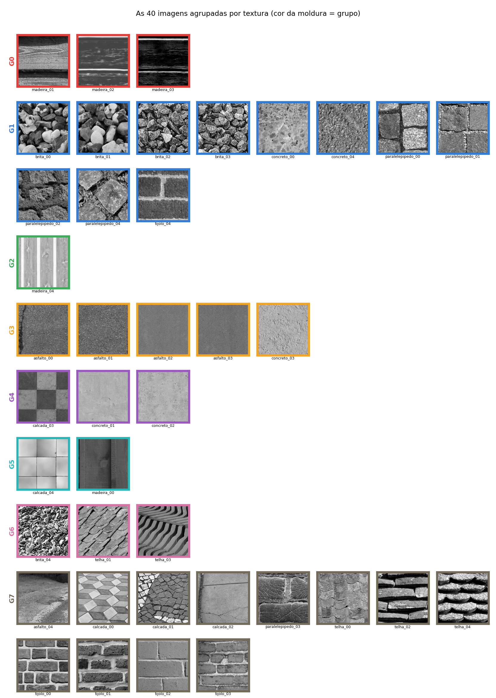

%%titulo: Agrupamento de texturas urbanas com filtros orientados em três escalas
%%autores: Vitor Lorenzo Cumim
%%curso: Visão Computacional — Trabalho 1 (versão resumida)
%%data: setembro de 2026
%%repo: https://github.com/vitorcumim/textura-urbana

## Resumo

Sete filtros de textura — quatro Gabor orientados a 0°, 45°, 90° e 135°, dois detectores de borda e um filtro circular — são aplicados em três escalas de uma pirâmide gaussiana. A média das respostas dentro de uma janela descreve cada região por um vetor de 24 dimensões, e um k-médias euclidiano agrupa os vetores próximos. Sobre 40 recortes de 512×512 em tons de cinza, de oito materiais urbanos, o método forma grupos visualmente coerentes (pureza 0,53) e, aplicado janela a janela, separa dentro de uma mesma imagem coisas como o rejunte e a face da pedra.

## 1. O problema

Duas regiões de uma imagem em cinza podem ter o mesmo histograma e ainda assim serem visivelmente diferentes: uma parede de tijolos e um trecho de asfalto podem ter o mesmo brilho médio, mas a parede tem linhas horizontais fortes e o asfalto não tem direção nenhuma. Textura é essa diferença — como a intensidade varia no espaço, em que direção e em que tamanho.

A receita clássica para medir isso é passar a imagem por filtros sintonizados em orientações e frequências diferentes e ver quanta energia cada um capta. É o que este trabalho faz, sem nenhum aprendizado de máquina: os filtros são fixos e projetados analiticamente, e o agrupamento é um k-médias de vinte linhas.

## 2. As imagens

São **40 imagens** de 512×512 pixels em tons de cinza, oito materiais urbanos com cinco imagens cada: asfalto, brita, calçada, concreto, madeira, paralelepípedo, telha e tijolo. As fotos vieram do Wikimedia Commons sob licenças livres, foram convertidas para cinza pela fórmula da ITU-R BT.601 (`Y = 0,299R + 0,587G + 0,114B`) e recortadas em blocos de 512×512 sem sobreposição. Autor e licença de cada foto estão em `fotos_originais/creditos.csv`.

Uma ressalva: o enunciado pede fotos tiradas pelo próprio grupo, e estas não são.

## 3. Os filtros e as escalas

O banco tem sete filtros de 15×15 pixels:

- **quatro Gabor de fase par** (uma onda cosseno vezes uma gaussiana) a 0°, 45°, 90° e 135°. A fase par tem um lobo central, então é um detector de **linha** — cobre as quatro orientações pedidas no enunciado;
- **dois Gabor de fase ímpar** (onda seno) a 0° e 90°. Sendo antissimétricos, detectam **borda**, não linha. Servem para diferenciar texturas que têm a mesma orientação dominante mas estrutura diferente;
- **um filtro circular**, o Laplaciano da gaussiana. É isotrópico — sua resposta em frequência é um anel — e responde a granulação sem direção preferida. É ele que caracteriza asfalto e brita.

Todos têm média zero, então nenhum responde a brilho constante: só a variação importa.


Para o multiescala, o enunciado permite dois caminhos; escolhemos o mais barato, que é manter os filtros do mesmo tamanho e encolher a imagem. A pirâmide gaussiana suaviza e pega um pixel a cada dois, dando níveis de 512×512, 256×256 e 128×128. Como o filtro continua 15×15, no nível 2 ele enxerga uma vizinhança quatro vezes maior da imagem original.

Sete filtros em três escalas dão **21 mapas de resposta** por imagem. De cada um toma-se o valor absoluto, porque uma barra clara e uma barra escura são a mesma textura — sem retificar, a média da janela daria quase zero nos dois casos.


## 4. O vetor de 24 dimensões

O descritor de uma região é a **média de cada mapa dentro da janela**, o que dá 21 números. Usar esses 21 números crus não funciona bem: eles crescem com o contraste da foto, e a distância euclidiana passa a medir *quanto contraste a imagem tem* em vez de *que textura ela é* — a mesma parede no sol e na sombra vira dois grupos.

A correção é separar as duas coisas. Cada escala vira oito números: as **sete frações** `r_i / (r_1+...+r_7)`, que dizem como a energia se reparte entre as orientações e o filtro circular (a *forma* da assinatura, invariante a contraste), e o **log da energia total** daquela escala (o *quanto* de textura existe ali). Três escalas × oito números = **24 dimensões**. Na prática essa mudança levou a pureza de 0,40 para 0,53.

O mesmo cálculo serve nas duas granularidades: com a imagem inteira como janela, sai um vetor por imagem, usado para agrupar as 40; com janelas de 64×64 andando de 32 em 32 pixels, saem 225 vetores por imagem, usados para segmentar por dentro.

## 5. Agrupamento

O k-médias é euclidiano, com centroides iniciais sorteados entre as próprias amostras, semente fixa e oito reinicializações, ficando com a de menor inércia. Antes, cada dimensão passa por z-score: as frações vivem entre 0 e 1 e a energia logarítmica vale alguns inteiros, então sem normalizar a distância ignoraria as dimensões de orientação.

Com k = 8, o número de materiais, a pureza é **0,53** — a fração de imagens que caiu no material majoritário do seu grupo.



| Grupo | n | O que reuniu |
|---|---|---|
| G0 | 3 | veio de madeira horizontal, listras finas e alongadas |
| G1 | 11 | granulado grosso e sem direção: brita, concreto granulado, pedra rugosa |
| G2 | 1 | tapume claro de ripas verticais |
| G3 | 5 | granulação fina e uniforme: asfalto, concreto |
| G4 | 3 | quase sem textura: concreto liso e ladrilho em xadrez |
| G5 | 2 | superfícies lisas cortadas por poucas juntas retas |
| G6 | 3 | estrias diagonais finas e repetidas: telha em fiada inclinada |
| G7 | 12 | blocos separados por juntas claras: tijolo, calçada, telha, pedra |

A pureza de 0,53 esconde um comportamento que a figura deixa claro: **os grupos são coerentes como textura mesmo quando não coincidem com o material**. G1 junta as quatro britas com concretos granulados, paralelepípedos rugosos e até uma parede de tijolo áspera — todos são granulação grossa isotrópica, e o filtro circular os vê como a mesma coisa. G7 junta tijolo, calçada em blocos, telha em fiada e pedra rachada, que são todos "blocos separados por juntas claras". Já as telhas se partiram em dois grupos: as de fiada inclinada foram para G6 e as empilhadas de frente para G7, porque são duas texturas bem diferentes que por acaso têm o mesmo nome.

Vale registrar uma observação que apareceu ao comparar esta versão com a completa, que usa inicialização k-means++: a versão completa chega a uma pureza melhor (0,58) com uma inércia **pior** (218,2 contra 210,5). Ou seja, o agrupamento que o k-médias considera melhor pelo seu próprio critério não é o que mais concorda com as etiquetas dos materiais. A pureza não é o que está sendo otimizado.

## 6. Segmentação dentro das imagens

Rodando o mesmo k-médias sobre as 9.000 janelas de 64×64 de todas as imagens, com k = 6, cada janela recebe a cor do grupo mais próximo.


Este é o resultado mais fácil de auditar a olho: as regiões que o método separa são as que uma pessoa apontaria. O mapa é grosseiro por construção — a menor unidade é uma janela de 64×64, então os limites saem em degraus de 32 pixels.

## 7. Limitações

- **Sem invariância a rotação**: girar a foto 45° muda o descritor por completo, consequência direta de usar orientações fixas.
- **Sem invariância a escala de aquisição**: as três escalas cobrem uma faixa de 4×; a mesma parede fotografada de perto e de longe pode cair em grupos diferentes.
- **k escolhido à mão**: adotamos k = 8 por ser o número de materiais, que é informação externa ao método.

## 8. Como rodar

```
pip install opencv-python numpy matplotlib
python simples/textura_simples.py
```

Um único arquivo, `simples/textura_simples.py`, faz tudo o que está descrito aqui e escreve as duas figuras em `simples/saida/`. A versão completa do trabalho está em `src/`, com o download e o preparo das fotos, escolha de k por silhueta, projeção PCA e mais figuras.

## Referências

1. Jain, A. K.; Farrokhnia, F. *Unsupervised texture segmentation using Gabor filters*. Pattern Recognition, v. 24, n. 12, 1991.
2. Randen, T.; Husøy, J. H. *Filtering for texture classification: a comparative study*. IEEE TPAMI, v. 21, n. 4, 1999.
3. Varma, M.; Zisserman, A. *A statistical approach to texture classification from single images*. IJCV, v. 62, 2005.
